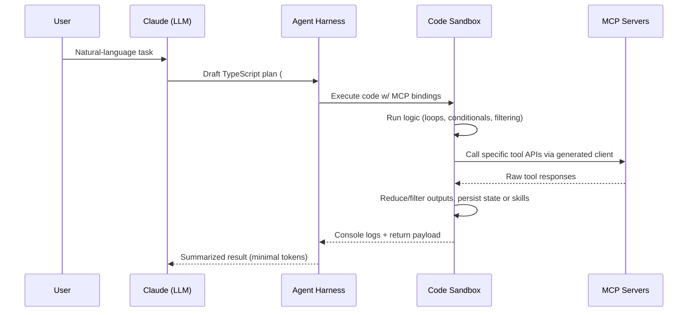

# Phase 1 – Anthropic Code-Mode Tool Calling Overview

## Source References
| ID | Reference | Notes |
| --- | --- | --- |
| [^anthropic] | [Anthropic — “Code execution with MCP: building more efficient AI agents”](https://www.anthropic.com/engineering/code-execution-with-mcp) | Primary description of code-mode execution, progressive disclosure, skills, and privacy patterns |
| [^cloudflare] | [Cloudflare — “Code Mode: the better way to use MCP”](https://blog.cloudflare.com/code-mode/) | Complementary engineering details on TypeScript API generation, Workers-based sandboxing, and performance data |

## Architectural Fundamentals
- **Execution Model**: The LLM emits TypeScript (or JS) code that targets a **single execution tool** (e.g., `run_code`). That code imports strongly-typed wrappers generated from connected MCP servers, which expose each tool call as a conventional function instead of JSON-based tool invocations.[^anthropic][^cloudflare]
- **Tool Surface via File System**: MCP servers are mounted as a virtual file tree (e.g., `./servers/google-drive/download.ts`). The model discovers tools by listing directories or using helper search utilities, pulling definitions only when needed (progressive disclosure).[^^anthropic]
- **Type Definition Generation**: SDKs (Cloudflare Agents) introspect MCP schemas and synthesize TypeScript interfaces with docstrings, so code-mode programs benefit from autocomplete, compile-time validation, and natural-language documentation embedded in comments.[^cloudflare]
- **State & Skills Layer**: Because the execution environment exposes a writeable workspace, agents can persist intermediate artifacts and promote successful routines into reusable “skills” (folders with `SKILL.md` plus scripts). Skills can later be referenced or improved without re-generating entire workflows.[^anthropic]
- **Sandbox Runtime**: Execution occurs in an isolated environment (e.g., Cloudflare Worker isolates or Anthropic’s secure sandboxes). The sandbox restricts outbound network access except through vetted MCP bindings, enforces resource limits, and supports rapid spin-up per run.[^cloudflare][^anthropic]

## Tool-Calling Lifecycle (Code Mode)

### Detailed Step Mapping
1. **Request Intake**: Model receives the user task but **does not ingest every tool definition upfront**. Instead, it uses the filesystem or `search_tool` to pull specific schemas, keeping prompts lightweight.[^anthropic]
2. **Code Authoring**: The model writes TypeScript against generated clients (e.g., `import { googleDrive, salesforce } from "./servers";`). This lets it leverage idiomatic loops, conditionals, and structured error handling.[^cloudflare]
3. **Execution & Sandboxing**:
   - Harness sends the code to an isolate (Cloudflare Workers or Anthropic’s secure runtime).
   - Sandbox enforces CPU/memory budgets, no ambient network, and mediates storage.[^cloudflare]
4. **MCP Invocation**: Within the sandbox, function calls (e.g., `await googleDrive.files.list()`) route through the harness, which performs actual MCP RPCs and streams responses back to the sandbox.
5. **Post-Processing**: Code trims, aggregates, or tokenizes results locally before logging concise summaries, drastically reducing round-trips through the LLM context.[^anthropic]
6. **Response Delivery**: Harness relays console output, return values, and optional artifacts back to Claude, which then crafts the final natural-language answer to the user.

## Core Components & Responsibilities
| Component | Role | Notes |
| --- | --- | --- |
| **File-System Tool Index** | Presents MCP servers as directories/files; supports `ls`, `cat`, and search filtering | Enables on-demand schema reads; satisfies progressive disclosure requirements |
| **Type Generator / Client SDK** | Converts MCP schemas to typed TS APIs | Cloudflare Agents SDK example; reduces prompt verbosity and errors[^cloudflare] |
| **Code Sandbox / Runner** | Executes generated TypeScript securely | Cloudflare uses Worker Loader API with V8 isolates; Anthropic mentions general secure sandbox with monitoring[^cloudflare][^anthropic] |
| **Skills Library** | Stores reusable scripts + metadata | Allows models to “save progress” and reuse success patterns; each skill folder may include `SKILL.md`, instructions, helper modules[^anthropic] |
| **Harness / Runtime Controller** | Mediates between Claude, sandbox, and MCP servers | Handles code upload, log capture, MCP dispatch, token accounting |

## Security & Isolation Mechanisms
- **Network Isolation**: Sandboxed code cannot access the public internet; only pre-bound MCP transports are available.[^cloudflare]
- **Data Tokenization**: Harness can intercept PII inside the sandbox, tokenize before exposing to the model, and detokenize when passing between MCP servers. Anthropic’s example shows email/phone fields protected via lookup tables.[^anthropic]
- **Least-Privilege Bindings**: Only approved MCP clients are exposed in the sandbox (e.g., select Google Drive scopes). Each binding is auditable through the generated API definition.[^cloudflare]
- **Resource Limits & Monitoring**: Sandboxes enforce CPU, memory, and execution time caps; isolates spin up rapidly and can be discarded after each run to prevent state leakage.[^cloudflare]

## Performance & Efficiency Mechanisms
- **Progressive Disclosure** reduces tool-definition tokens by exposing only the folders/files the agent explicitly opens. Anthropic cites cases where thousands of definitions stay out of the prompt.[^anthropic]
- **Context-Efficient Results**: Large datasets (spreadsheets, transcripts) are filtered in code before results return to the model, so only synthesized insights consume tokens.[^anthropic]
- **Control-Flow Compression**: Loops, retries, polling, and branching occur entirely inside the sandbox, eliminating multiple tool-call turns through the LLM (Cloudflare reports dramatic throughput gains when chaining operations).[^cloudflare]
- **State Persistence / Skills**: Agents can checkpoint work, resume tasks, or reuse code snippets without re-describing them, improving both latency and reliability.[^anthropic]
- **Worker-Based Sandboxes**: V8 isolates start in milliseconds with MB-level footprints; Cloudflare emphasizes they’re faster and cheaper than containerized runtimes for per-task code execution.[^cloudflare]

## Dependencies, Constraints, and Prerequisites
- **MCP Schema Availability**: Code-mode relies on MCP servers exposing complete JSON schemas so that TypeScript stubs can be generated automatically.[^cloudflare]
- **Sandbox Infrastructure**: Requires an execution service capable of compiling/running TypeScript safely (Deno, Node, Workers) with deterministic resource limits.[^cloudflare][^anthropic]
- **Tool Metadata**: File-tree entries must include docs/metadata to help the LLM select relevant tools when browsing. Optional search helpers (e.g., `search_tool`) accelerate discovery.[^anthropic]
- **Skill Governance**: Persisted skills must be permissioned and version-controlled to avoid stale or unsafe routines; teams often add review workflows before promoting new skills.[^anthropic]
- **Observability Hooks**: Harness should capture logs, stdout, and error stacks for debugging since code is executed outside the model’s direct view.[^cloudflare]

---

[^anthropic]: Anthropic, “Code execution with MCP: building more efficient AI agents,” Nov 2024.  
[^cloudflare]: Cloudflare, “Code Mode: the better way to use MCP,” Sept 26, 2025.

