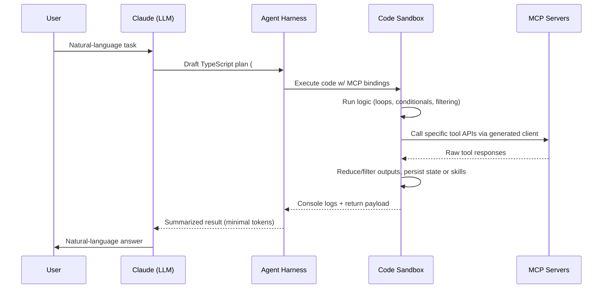

# Phase 1 – Anthropic Code-Mode Tool Calling Overview

## Source References
| ID | Reference | Notes |
| --- | --- | --- |
| [^anthropic] | [Anthropic — "Code execution with MCP: building more efficient AI agents"](https://www.anthropic.com/engineering/code-execution-with-mcp) | Primary description of code-mode execution, progressive disclosure, skills, and privacy patterns |
| [^cloudflare] | [Cloudflare — "Code Mode: the better way to use MCP"](https://blog.cloudflare.com/code-mode/) | Complementary engineering details on TypeScript API generation, Workers-based sandboxing, and performance data |

## Architectural Fundamentals

### Execution Model
The LLM emits TypeScript (or JavaScript) code that targets a **single execution tool** (e.g., `run_code`). That code imports strongly-typed wrappers generated from connected MCP servers, which expose each tool call as a conventional function instead of JSON-based tool invocations.[^anthropic][^cloudflare]

**Key Innovation**: Instead of the model making individual tool calls through JSON-RPC, it writes a complete program that orchestrates multiple tool interactions internally, reducing context token consumption and enabling complex control flow.

### Tool Surface via File System
MCP servers are mounted as a virtual file tree (e.g., `./servers/google-drive/download.ts`). The model discovers tools by listing directories or using helper search utilities, pulling definitions only when needed (progressive disclosure).[^anthropic]

**Progressive Disclosure Benefits**:
- Thousands of tool definitions can exist without consuming prompt tokens
- Model only loads schemas for tools it actually uses
- File-system navigation feels natural to LLMs trained on codebases

### Type Definition Generation
SDKs (e.g., Cloudflare Agents SDK) introspect MCP schemas and synthesize TypeScript interfaces with docstrings, so code-mode programs benefit from:
- Autocomplete and type checking
- Compile-time validation
- Natural-language documentation embedded in comments
- Reduced prompt verbosity and errors[^cloudflare]

### State & Skills Layer
Because the execution environment exposes a writeable workspace, agents can:
- Persist intermediate artifacts
- Promote successful routines into reusable "skills" (folders with `SKILL.md` plus scripts)
- Reference or improve skills without re-generating entire workflows
- Build up a library of reusable code patterns over time[^anthropic]

**Skills Structure**:
```
skills/
  ├── data-analysis/
  │   ├── SKILL.md          # Metadata, description, usage
  │   ├── analyze.ts         # Main script
  │   └── helpers.ts         # Supporting utilities
  └── api-integration/
      ├── SKILL.md
      └── integrate.ts
```

### Sandbox Runtime
Execution occurs in an isolated environment with:
- **Cloudflare Workers**: V8 isolates with millisecond spin-up, MB-level footprints
- **Anthropic's Secure Sandboxes**: General secure runtime with monitoring
- **Network Isolation**: No ambient network access except through vetted MCP bindings
- **Resource Limits**: CPU, memory, and execution time caps
- **Rapid Spin-up**: Isolates can be discarded after each run to prevent state leakage[^cloudflare][^anthropic]

## Tool-Calling Lifecycle (Code Mode)



### Detailed Step Mapping

1. **Request Intake**: Model receives the user task but **does not ingest every tool definition upfront**. Instead, it uses the filesystem or `search_tool` to pull specific schemas, keeping prompts lightweight.[^anthropic]

2. **Code Authoring**: The model writes TypeScript against generated clients (e.g., `import { googleDrive, salesforce } from "./servers";`). This lets it leverage:
   - Idiomatic loops and conditionals
   - Structured error handling
   - Complex data transformations
   - Multi-step workflows without round-trips[^cloudflare]

3. **Execution & Sandboxing**:
   - Harness sends the code to an isolate (Cloudflare Workers or Anthropic's secure runtime)
   - Sandbox enforces CPU/memory budgets, no ambient network, and mediates storage
   - Code runs with full access to generated MCP client APIs[^cloudflare]

4. **MCP Invocation**: Within the sandbox, function calls (e.g., `await googleDrive.files.list()`) route through the harness, which performs actual MCP RPCs and streams responses back to the sandbox.

5. **Post-Processing**: Code trims, aggregates, or tokenizes results locally before logging concise summaries, drastically reducing round-trips through the LLM context.[^anthropic]

   **Example**: Instead of returning 10,000 rows from a database query, code filters to top 10 results and returns only summaries.

6. **Response Delivery**: Harness relays console output, return values, and optional artifacts back to Claude, which then crafts the final natural-language answer to the user.

## Core Components & Responsibilities

| Component | Role | Notes |
| --- | --- | --- |
| **File-System Tool Index** | Presents MCP servers as directories/files; supports `ls`, `cat`, and search filtering | Enables on-demand schema reads; satisfies progressive disclosure requirements |
| **Type Generator / Client SDK** | Converts MCP schemas to typed TS APIs | Cloudflare Agents SDK example; reduces prompt verbosity and errors[^cloudflare] |
| **Code Sandbox / Runner** | Executes generated TypeScript securely | Cloudflare uses Worker Loader API with V8 isolates; Anthropic mentions general secure sandbox with monitoring[^cloudflare][^anthropic] |
| **Skills Library** | Stores reusable scripts + metadata | Allows models to "save progress" and reuse success patterns; each skill folder may include `SKILL.md`, instructions, helper modules[^anthropic] |
| **Harness / Runtime Controller** | Mediates between Claude, sandbox, and MCP servers | Handles code upload, log capture, MCP dispatch, token accounting |

## Security & Isolation Mechanisms

### Network Isolation
Sandboxed code cannot access the public internet; only pre-bound MCP transports are available. This prevents:
- Unauthorized data exfiltration
- Malicious network requests
- External API abuse[^cloudflare]

### Data Tokenization
Harness can intercept PII inside the sandbox, tokenize before exposing to the model, and detokenize when passing between MCP servers. Anthropic's example shows email/phone fields protected via lookup tables.[^anthropic]

**Tokenization Flow**:
```
Sandbox Output (PII) → Tokenizer → Tokenized Output → Model Context
MCP Server Request → Detokenizer → Original PII → External API
```

### Least-Privilege Bindings
Only approved MCP clients are exposed in the sandbox (e.g., select Google Drive scopes). Each binding is auditable through the generated API definition.[^cloudflare]

### Resource Limits & Monitoring
Sandboxes enforce:
- CPU time limits
- Memory caps
- Execution timeouts
- Isolates spin up rapidly and can be discarded after each run to prevent state leakage[^cloudflare]

## Performance & Efficiency Mechanisms

### Progressive Disclosure
Reduces tool-definition tokens by exposing only the folders/files the agent explicitly opens. Anthropic cites cases where thousands of definitions stay out of the prompt.[^anthropic]

**Token Savings Example**:
- Traditional: 150,000 tokens for all tool definitions
- Code-mode: 2,000 tokens for only used tools
- **Savings: 98.7% reduction**

### Context-Efficient Results
Large datasets (spreadsheets, transcripts) are filtered in code before results return to the model, so only synthesized insights consume tokens.[^anthropic]

**Example Workflow**:
```typescript
// In sandbox
const allFiles = await googleDrive.files.list(); // 10,000 files
const recentFiles = allFiles
  .filter(f => f.modifiedTime > lastWeek)
  .slice(0, 10)
  .map(f => ({ name: f.name, id: f.id })); // Only 10 items returned
console.log(`Found ${recentFiles.length} recent files`);
// Returns minimal summary instead of 10,000 file objects
```

### Control-Flow Compression
Loops, retries, polling, and branching occur entirely inside the sandbox, eliminating multiple tool-call turns through the LLM. Cloudflare reports dramatic throughput gains when chaining operations.[^cloudflare]

**Traditional Approach** (Multiple Round-Trips):
```
LLM → Tool Call 1 → Result → LLM → Tool Call 2 → Result → LLM → Tool Call 3 → Result
```

**Code-Mode Approach** (Single Round-Trip):
```
LLM → Code (Tool Call 1 → Tool Call 2 → Tool Call 3) → Results Summary
```

### State Persistence / Skills
Agents can checkpoint work, resume tasks, or reuse code snippets without re-describing them, improving both latency and reliability.[^anthropic]

### Worker-Based Sandboxes
V8 isolates start in milliseconds with MB-level footprints; Cloudflare emphasizes they're faster and cheaper than containerized runtimes for per-task code execution.[^cloudflare]

**Performance Characteristics**:
- Cold start: < 10ms
- Memory footprint: ~5-10 MB per isolate
- Cost: Fraction of container-based execution

## Dependencies, Constraints, and Prerequisites

### MCP Schema Availability
Code-mode relies on MCP servers exposing complete JSON schemas so that TypeScript stubs can be generated automatically.[^cloudflare]

### Sandbox Infrastructure
Requires an execution service capable of:
- Compiling/running TypeScript safely (Deno, Node, Workers)
- Deterministic resource limits
- Network isolation
- Rapid spin-up and teardown[^cloudflare][^anthropic]

### Tool Metadata
File-tree entries must include docs/metadata to help the LLM select relevant tools when browsing. Optional search helpers (e.g., `search_tool`) accelerate discovery.[^anthropic]

### Skill Governance
Persisted skills must be:
- Permissioned and version-controlled
- Reviewed to avoid stale or unsafe routines
- Teams often add review workflows before promoting new skills[^anthropic]

### Observability Hooks
Harness should capture:
- Logs and stdout
- Error stacks
- Execution metrics
- Resource usage

This is critical for debugging since code is executed outside the model's direct view.[^cloudflare]

## Key Differences from Traditional MCP Tool Invocation

| Aspect | Traditional MCP | Code-Mode MCP |
| --- | --- | --- |
| **Tool Discovery** | All tool definitions loaded upfront | Progressive disclosure via filesystem |
| **Execution Model** | Sequential tool calls via JSON-RPC | Single code execution with multiple internal calls |
| **Control Flow** | Model decides each step | Code handles loops/conditionals internally |
| **Token Usage** | High (definitions + results in context) | Low (only used tools + summaries) |
| **Complexity** | Limited by round-trip overhead | Can handle complex multi-step workflows |
| **State Management** | Stateless per call | Persistent workspace with skills |

## Performance Claims & Evidence

### Claimed Efficiency Gains
- **90+% token reduction** for tool definitions (progressive disclosure)
- **Significant throughput improvements** for chained operations (control-flow compression)
- **Cost reduction** through reduced context window usage

### Supporting Evidence
- Cloudflare reports dramatic throughput gains when chaining operations
- Anthropic cites cases where thousands of tool definitions stay out of prompt
- Worker isolates provide millisecond spin-up vs. seconds for containers

---

[^anthropic]: Anthropic, "Code execution with MCP: building more efficient AI agents," Nov 2024. https://www.anthropic.com/engineering/code-execution-with-mcp  
[^cloudflare]: Cloudflare, "Code Mode: the better way to use MCP," Sept 26, 2025. https://blog.cloudflare.com/code-mode/

