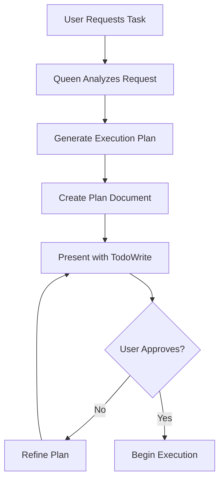

# Transparent Swarm Coordination Protocol (TSCP)

**Version:** 1.0.0
**Status:** Design Specification
**Author:** System Architecture Designer
**Date:** 2025-11-13

## Executive Summary

The Transparent Swarm Coordination Protocol (TSCP) establishes mandatory visibility checkpoints in multi-agent workflows, ensuring users see the plan before execution, receive notifications during work, and can review artifacts in real-time. This protocol transforms opaque agent execution into a transparent, reviewable process.

---

## 1. Protocol Overview

### 1.1 Core Principles

1. **Plan-First Execution** - No agent work begins until user reviews and approves the plan
2. **Real-Time Visibility** - Users are notified when artifacts are created/modified
3. **Progressive Disclosure** - Information presented at appropriate detail levels
4. **Automatic Enforcement** - Protocol runs by default; no manual activation required

### 1.2 Three-Phase Architecture

```
┌─────────────────────────────────────────────────────────────┐
│                    PHASE 1: PLANNING                        │
│  Queen creates execution plan → User reviews → Approval     │
└────────────────────┬────────────────────────────────────────┘
                     │
                     ▼ (User Approval Required)
┌─────────────────────────────────────────────────────────────┐
│                   PHASE 2: EXECUTION                        │
│  Agents work → Document creation notifications → Progress   │
└────────────────────┬────────────────────────────────────────┘
                     │
                     ▼ (Automatic)
┌─────────────────────────────────────────────────────────────┐
│                   PHASE 3: CLOSEOUT                         │
│  Summary generation → User review → Archive                 │
└─────────────────────────────────────────────────────────────┘
```

---

## 2. Phase 1: Pre-Execution Planning

### 2.1 Objectives

- Generate comprehensive execution plan before any agent spawns
- Present plan with full TodoWrite breakdown
- Obtain explicit user approval before proceeding

### 2.2 Planning Workflow



### 2.3 Plan Document Structure

**Filename:** `sessions/<session-id>/artifacts/execution-plan.md`

**Required Sections:**

1. **Mission Statement** - What we're building/solving
2. **Success Criteria** - How we'll know we're done
3. **Agent Roster** - Who's doing what (type, role, capabilities)
4. **Execution Strategy** - Parallel/sequential/adaptive approach
5. **Work Breakdown** - Detailed todo list (8-12+ items)
6. **Artifact Inventory** - Expected outputs with paths
7. **Risk Assessment** - Potential blockers and mitigations
8. **Estimated Timeline** - Rough completion expectations

### 2.4 TodoWrite Requirements

When presenting the plan, Claude Code MUST:

```javascript
TodoWrite({
  todos: [
    {
      id: "plan-approval",
      content: "User reviews and approves execution plan",
      activeForm: "Awaiting user approval for execution plan",
      status: "in_progress",
      priority: "critical"
    },
    {
      id: "phase1-research",
      content: "Research agent analyzes requirements and patterns",
      activeForm: "Research agent analyzing requirements and patterns",
      status: "pending",
      priority: "high"
    },
    // ... 8-12+ todos covering all planned work
  ]
})
```

### 2.5 User Approval Protocol

**Claude Code MUST:**

1. Present plan document location
2. Show TodoWrite with all planned tasks
3. Explicitly ask: "Review the execution plan at `<path>`. Approve to proceed?"
4. Wait for explicit approval (yes/go/proceed/approved)
5. Do NOT spawn agents until approval received

**User MUST:**

1. Review `execution-plan.md`
2. Check TodoWrite aligns with expectations
3. Provide explicit approval OR request changes

---

## 3. Phase 2: During Execution

### 3.1 Objectives

- Notify user when documents are created/modified
- Show progress as todos complete
- Enable real-time artifact review

### 3.2 Document Creation Notifications

**Trigger Points:** Agent creates/modifies any file in `sessions/<session-id>/artifacts/`

**Notification Format:**
```
📄 Document Created: `sessions/<session-id>/artifacts/specifications/api-design.md`
   Agent: Backend Architect
   Phase: Architecture Design
   Status: Draft complete, ready for review
```

**Implementation:**
- Agent uses `post-edit` hook after file operations
- Claude Code surfaces notification in conversation
- User can review document at any time

### 3.3 Progress Tracking

**Real-Time Todo Updates:**

```javascript
// As agents complete work, todos automatically update
TodoWrite({
  todos: [
    {
      id: "plan-approval",
      status: "completed" // ✓
    },
    {
      id: "phase1-research",
      status: "completed" // ✓
    },
    {
      id: "phase2-architecture",
      status: "in_progress", // 🔄 Currently working
      progress: "Database schema complete, API design in progress"
    },
    {
      id: "phase3-implementation",
      status: "pending" // ⏳ Not started
    }
  ]
})
```

### 3.4 Phase Completion Reports

When a major phase completes (e.g., all architecture todos done), Claude Code MUST:

```
✅ Phase Complete: Architecture Design

Artifacts Created:
- `sessions/<session-id>/artifacts/specifications/api-design.md`
- `sessions/<session-id>/artifacts/diagrams/system-architecture.md`
- `sessions/<session-id>/artifacts/specifications/data-model.md`

Next Phase: Implementation (3 agents spawning)
```

---

## 4. Phase 3: Closeout

### 4.1 Objectives

- Generate comprehensive session summary
- User reviews and approves for archival
- Capture lessons learned

### 4.2 Summary Generation

**Automatic:** Claude Code maintains `session-summary.md` throughout execution

**Final Review:** User reviews summary and either:
- Approves → Archived to Captain's Log
- Requests changes → Summary refined

### 4.3 Archive Protocol

After user approval:

```bash
# Standard closeout hooks
npx claude-flow@alpha hooks post-task --task-id "swarm-<session-id>"
npx claude-flow@alpha hooks session-end --export-metrics true
```

This creates `.swarm/backups/<timestamp>/` with full session state.

---

## 5. Integration Architecture

### 5.1 Hook Points

**Existing Infrastructure:**

```
claude-flow hooks (stock)
├── pre-task (before agent starts)
├── post-edit (after file operations)
├── post-task (after agent completes)
├── session-restore (restore context)
└── session-end (archive state)
```

**New TSCP Integration:**

```
TSCP Layer (thin wrapper)
├── tscp-plan-generate (calls pre-task, creates plan doc)
├── tscp-notify-artifact (wraps post-edit, adds notification)
├── tscp-progress-update (wraps post-task, updates todos)
└── tscp-closeout (wraps session-end, HITL review)
```

### 5.2 Swarm Initialization Changes

**Current Flow:**
```javascript
swarm_init → agent_spawn → task_orchestrate → execution
```

**TSCP-Enhanced Flow:**
```javascript
swarm_init → tscp_plan_generate → [USER APPROVAL] → agent_spawn → task_orchestrate → execution
                                        ↑
                                    BLOCKING
```

### 5.3 Agent Prompt Modifications

**Every agent spawned via Task tool MUST include:**

```markdown
## TSCP Protocol Requirements

You are part of a transparent swarm. You MUST:

1. **Before starting work:**
   - Check execution plan at `sessions/<session-id>/artifacts/execution-plan.md`
   - Understand your role and success criteria

2. **During work:**
   - Create artifacts in `sessions/<session-id>/artifacts/<category>/`
   - After creating/modifying files, notify via hook:
     ```bash
     npx claude-flow@alpha hooks post-edit \
       --file "<path>" \
       --memory-key "swarm/<agent-id>/<step>"
     ```

3. **After completing tasks:**
   - Update progress in session summary
   - Run post-task hook with status

4. **Document everything:**
   - Write clear, reviewable artifacts
   - Explain decisions in comments/docs
   - Link related work in memory
```

---

## 6. CLAUDE.md Updates Required

### 6.1 New Section: "Transparent Swarm Protocol"

Insert after "Agent Coordination Protocol" section:

```markdown
## 🔍 Transparent Swarm Protocol (TSCP)

ALL swarm coordination MUST follow the Transparent Swarm Protocol for visibility:

### Phase 1: Planning (BLOCKING - User Approval Required)

**MANDATORY BEFORE spawning agents:**

1. Generate execution plan document:
   ```bash
   # Plan includes: mission, success criteria, agent roster,
   # work breakdown, artifact inventory, risks
   sessions/<session-id>/artifacts/execution-plan.md
   ```

2. Present plan with TodoWrite (8-12+ todos):
   ```javascript
   TodoWrite({ todos: [...all planned work...] })
   ```

3. **WAIT for explicit user approval** - Do NOT proceed without it

4. Example presentation:
   ```
   I've created the execution plan at:
   `sessions/<session-id>/artifacts/execution-plan.md`

   This plan includes 5 agents working across 3 phases:
   [TodoWrite showing 10 todos]

   Please review the plan. Type "approved" to begin execution.
   ```

### Phase 2: Execution (Automatic Notifications)

**During agent work:**

1. When agents create/modify artifacts, automatically notify:
   ```
   📄 Document Created: `<path>`
      Agent: <name>
      Phase: <phase>
   ```

2. Update todos as work progresses (real-time status)

3. When phases complete, summarize artifacts created

### Phase 3: Closeout (HITL Review)

**After execution:**

1. Present session summary for review
2. User approves or requests changes
3. Run closeout hooks after approval

### TSCP Enforcement

- **All swarm operations automatically use TSCP**
- User can skip planning phase by saying "skip TSCP approval"
- Progress notifications are always enabled
```

### 6.2 Modified Agent Execution Flow Section

Update "Agent Execution Flow with Claude Code" section:

```markdown
### The Correct Pattern with TSCP:

1. **REQUIRED**: Generate execution plan and get user approval (TSCP Phase 1)
2. **Optional**: Use MCP tools to set up coordination topology
3. **REQUIRED**: Use Claude Code's Task tool to spawn agents (TSCP Phase 2)
4. **REQUIRED**: Each agent runs hooks for coordination and notifications
5. **REQUIRED**: All operations batched in single messages
6. **REQUIRED**: User reviews summary after execution (TSCP Phase 3)
```

### 6.3 New Concurrent Execution Example

Add TSCP-compliant example:

```markdown
### ✅ CORRECT WORKFLOW: TSCP + MCP Coordination + Claude Code Execution

// Step 0: TSCP Planning Phase (BLOCKING)
[Single Message - Generate Plan]:
  Write "sessions/<session-id>/artifacts/execution-plan.md"
  TodoWrite { todos: [...10+ todos including approval step...] }

  Present plan to user and WAIT for approval

// [USER APPROVES PLAN]

// Step 1: MCP coordination setup (optional)
[Single Message - Coordination Setup]:
  mcp__claude-flow__swarm_init { topology: "mesh", maxAgents: 6 }

// Step 2: Claude Code Task tool spawns agents
[Single Message - Parallel Agent Execution with TSCP]:
  Task("Research Agent", "...check execution-plan.md for role...", "researcher")
  Task("Coder Agent", "...notify after file creation...", "coder")
  Task("Tester Agent", "...update progress in summary...", "tester")

  // Progress updates happen automatically via hooks

// Step 3: TSCP Closeout (HITL)
[Single Message - Present Summary]:
  Read "sessions/<session-id>/artifacts/session-summary.md"
  Present summary for user review

  WAIT for approval before running session-end hook
```

---

## 7. Architectural Decisions

### 7.1 ADR-001: Blocking Approval in Planning Phase

**Context:** Users need to review plans before expensive agent work begins.

**Decision:** Phase 1 planning is BLOCKING - no agents spawn until explicit approval.

**Rationale:**
- Prevents wasted work on misaligned plans
- Gives users control over resource allocation
- Allows early course correction

**Trade-offs:**
- Adds manual step to workflow (+30-60 seconds)
- Requires user to be present for approval
- Acceptable because planning is quick and prevents larger waste

### 7.2 ADR-002: Automatic Notifications vs. Opt-In

**Context:** Should document notifications be automatic or user-configurable?

**Decision:** Notifications are AUTOMATIC by default, with opt-out option.

**Rationale:**
- Default transparency aligns with protocol goals
- Users can mute if overwhelming (add `--quiet` flag)
- Better to have visibility and reduce than miss important updates

**Trade-offs:**
- May create notification fatigue for large swarms
- Acceptable because users can configure verbosity

### 7.3 ADR-003: Stock Hooks vs. Custom Notification System

**Context:** Should we build custom notification infrastructure?

**Decision:** Wrap existing claude-flow hooks with thin TSCP layer.

**Rationale:**
- Adheres to "stock-first" principle (95% stock, 5% wrapper)
- Leverages battle-tested hook system
- Updates to claude-flow benefit TSCP automatically

**Trade-offs:**
- Slightly less flexibility than custom system
- Acceptable because hooks cover 95% of use cases

### 7.4 ADR-004: Plan Document Format

**Context:** Should plans be JSON, YAML, or Markdown?

**Decision:** Markdown with structured sections.

**Rationale:**
- Human-readable without tools
- Version control friendly
- Easy to review and annotate
- Can be promoted to project docs without conversion

**Trade-offs:**
- Less machine-parseable than JSON/YAML
- Acceptable because human review is primary use case

---

## 8. Implementation Checklist

### 8.1 Infrastructure Changes

- [ ] Create `tscp-plan-generate` wrapper script
- [ ] Create `tscp-notify-artifact` wrapper script
- [ ] Create `tscp-progress-update` wrapper script
- [ ] Create `tscp-closeout` wrapper script
- [ ] Add TSCP scripts to `package.json` bin entries

### 8.2 CLAUDE.md Updates

- [ ] Add "Transparent Swarm Protocol" section
- [ ] Update "Agent Execution Flow" section
- [ ] Add TSCP-compliant examples
- [ ] Update "Agent Coordination Protocol" with TSCP hooks
- [ ] Document opt-out mechanism (`--skip-tscp-approval`)

### 8.3 Agent Prompt Templates

- [ ] Create base TSCP agent prompt fragment
- [ ] Update all 54 agent definitions to include TSCP requirements
- [ ] Add execution plan reference to agent instructions
- [ ] Add notification requirements to file operation instructions

### 8.4 Testing & Validation

- [ ] Test plan generation with sample task
- [ ] Verify blocking approval mechanism
- [ ] Test notification system with multi-agent swarm
- [ ] Validate closeout HITL workflow
- [ ] Test opt-out scenarios

### 8.5 Documentation

- [ ] Create user guide for TSCP workflow
- [ ] Add troubleshooting section (what if approval stalls?)
- [ ] Document notification configuration options
- [ ] Create video walkthrough of TSCP in action

---

## 9. Example Workflows

### 9.1 Simple Feature Implementation

**User Request:** "Build a REST API for user authentication"

**TSCP Flow:**

```
[Claude Code - Planning Phase]
I'll create an execution plan for building the authentication API.

📄 Execution Plan: sessions/20251113-180000-auth-api/artifacts/execution-plan.md

Plan Summary:
- Mission: Build secure REST API with JWT authentication
- Agents: 4 (Backend Dev, Database Architect, Security Auditor, Tester)
- Strategy: Sequential architecture, then parallel implementation/testing
- Estimated artifacts: 8 documents (API spec, schema, code, tests, docs)

[TodoWrite: 12 todos including approval]

Please review the execution plan. Type "approved" to begin execution.

[User: "approved"]

Starting execution with 4 agents...

📄 Document Created: sessions/20251113-180000-auth-api/artifacts/specifications/api-endpoints.md
   Agent: Backend Developer
   Phase: API Design

📄 Document Created: sessions/20251113-180000-auth-api/artifacts/specifications/database-schema.md
   Agent: Database Architect
   Phase: Data Modeling

[Progress updates continue...]

✅ Phase Complete: Implementation
   Artifacts: 5 new files created
   Next: Testing & Security Audit

[After execution]

Session summary ready for review:
sessions/20251113-180000-auth-api/artifacts/session-summary.md

All tests passed, security audit complete. Approve for archival?
```

### 9.2 Complex Multi-Phase Project

**User Request:** "Migrate monolith to microservices architecture"

**TSCP Flow:**

```
[Claude Code - Planning Phase]
This is a complex migration requiring multi-phase execution.

📄 Execution Plan: sessions/20251113-181500-microservices-migration/artifacts/execution-plan.md

Plan Summary:
- Mission: Decompose monolith into 5 microservices
- Phases: 3 (Analysis, Architecture, Implementation)
- Agents: 8 (Architect, 5x Backend Devs, Migration Planner, Tester)
- Strategy: Sequential phases, parallel service implementation
- Estimated artifacts: 20+ documents
- Timeline: ~45 minutes estimated

[TodoWrite: 18 todos across 3 phases]

⚠️ Note: This is a large migration. Review plan carefully before proceeding.

Please review the execution plan. Type "approved" to begin execution.

[User: "approved"]

Phase 1: Analysis - Starting with 2 agents...

📄 Document Created: sessions/.../artifacts/analysis/dependency-graph.md
   Agent: System Architect
   Phase: Dependency Analysis

📄 Document Created: sessions/.../artifacts/analysis/service-boundaries.md
   Agent: Migration Planner
   Phase: Service Decomposition

✅ Phase 1 Complete: Analysis
   Artifacts: 4 documents created
   Key Finding: User service can be extracted first (lowest dependencies)

   Proceeding to Phase 2: Architecture

[Continues through all phases with notifications...]
```

---

## 10. Non-Functional Requirements

### 10.1 Performance

- Planning phase overhead: < 30 seconds (plan generation)
- Notification latency: < 1 second (post file operation)
- Progress updates: Real-time (via hook execution)

### 10.2 Scalability

- Small swarms (2-3 agents): Full verbosity, all notifications
- Medium swarms (4-8 agents): Grouped notifications by phase
- Large swarms (9+ agents): Summary notifications, detailed log available

### 10.3 Reliability

- If approval blocks indefinitely: Timeout after 10 minutes with warning
- If notification fails: Log error, continue execution (non-blocking)
- If plan generation fails: Present error, allow manual planning

### 10.4 Usability

- Plan documents: Plain Markdown, no specialized tools required
- Notifications: Clear agent attribution, direct file links
- Progress: Visual indicators (✅ ✓ 🔄 ⏳) for quick scanning

---

## 11. Future Enhancements

### 11.1 Phase 2 Additions (Post-1.0)

1. **Interactive Plan Refinement**
   - User can edit plan directly in markdown
   - Claude re-parses and adjusts agent assignments

2. **Progress Visualizations**
   - ASCII dependency graphs showing which agents block others
   - Real-time token usage tracking

3. **Smart Notifications**
   - ML-based filtering: only surface high-priority artifacts
   - User preferences learned over time

4. **Replay & Rewind**
   - Restore swarm to any checkpoint
   - Re-execute from failed phase

### 11.2 Phase 3 Additions (Advanced)

1. **Multi-User Collaboration**
   - Multiple users can approve/review
   - Roles: observer, reviewer, approver

2. **Plan Templates**
   - Save successful plans as reusable templates
   - "Migration plan", "API development plan", etc.

3. **Compliance Modes**
   - Enterprise: All plans require dual approval
   - Audit trail: Cryptographic proof of review

---

## 12. Glossary

- **TSCP**: Transparent Swarm Coordination Protocol
- **HITL**: Human-In-The-Loop (user review/approval)
- **Blocking**: Execution cannot proceed until action completes
- **Artifact**: Any file created in `sessions/<session-id>/artifacts/`
- **Phase**: Major stage of execution (Planning, Execution, Closeout)
- **Queen**: Coordinating agent (Claude Code) that orchestrates swarm

---

## 13. References

- Claude-Flow Documentation: https://github.com/ruvnet/claude-flow
- Stock-First Principle: Workspace Learning Infrastructure (CLAUDE.md)
- Hook System: `npx claude-flow@alpha hooks --help`
- Session Management: Workspace Structure (CLAUDE.md)

---

## 14. Appendix: TSCP vs. Stock Workflow

| Aspect | Stock claude-flow | TSCP Enhancement |
|--------|------------------|------------------|
| Planning | Optional, ad-hoc | Mandatory, structured, user-reviewed |
| Execution Start | Immediate | After user approval (blocking) |
| Progress Visibility | Logs only | Real-time notifications + todos |
| Artifact Tracking | Manual discovery | Automatic notification |
| Closeout | Automatic archive | HITL summary review |
| Overhead | Minimal | +30-60s planning, +30s closeout |

**Key Insight:** TSCP adds ~1-2 minutes overhead for 30-60 minutes of transparent, controllable execution.

---

**Protocol Status:** Ready for implementation
**Next Steps:** Review with team → Implement checklist → Test with pilot swarm
